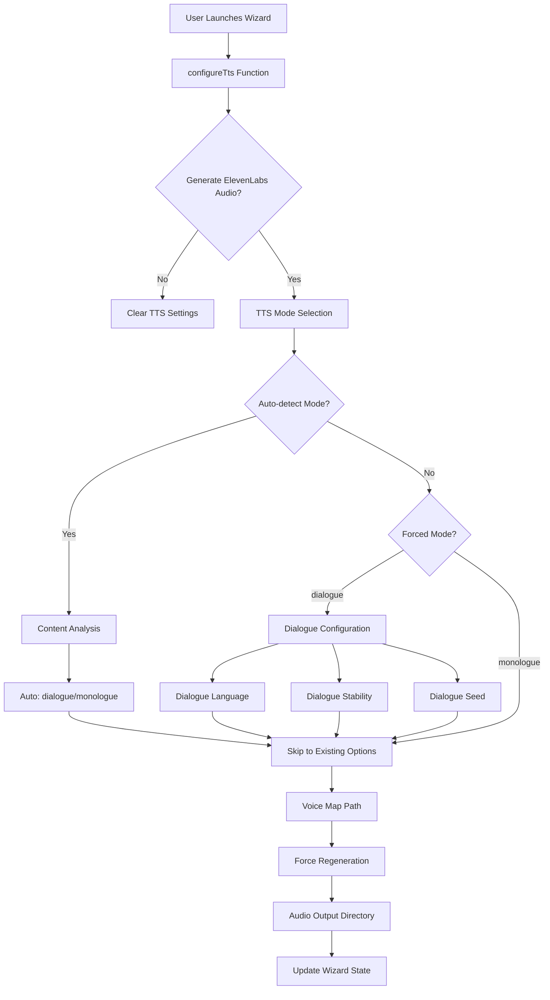

# Wizard Extension for Dual TTS Mode Selection - Design Document

## Executive Summary

This document specifies the technical design for extending the orchestrator's interactive wizard to support dual TTS mode selection, enabling users to choose between auto-detection, forced dialogue mode, or forced monologue mode when generating ElevenLabs audio.

**Key Design Goals:**

- **Seamless Integration** - Extend existing wizard patterns without breaking changes
- **Intuitive UX** - Multi-step flow with smart defaults and validation
- **Backward Compatibility** - Existing wizard defaults and configurations continue to work
- **Environment Variable Support** - Full CLI and programmatic API support
- **State Management** - Robust tracking of field origins and validation

---

## 1. Architecture Overview

### 1.1 High-Level Data Flow



### 1.2 Integration Points

The dual TTS mode extension integrates at these key points:

1. **Type Definitions** - `NewAssignmentFlags` interface extension
2. **Wizard State** - New state fields with origin tracking
3. **CLI Integration** - New command-line flags
4. **Environment Variables** - TTS mode and dialogue settings
5. **Persistence Layer** - Wizard defaults storage
6. **Validation Logic** - Input validation and error handling

---

## 2. Type System Extensions

### 2.1 NewAssignmentFlags Interface Updates

**File:** `packages/orchestrator/src/index.ts`

```typescript
export type NewAssignmentFlags = {
  md: string;
  student?: string;
  preset?: string;
  presetsPath?: string;
  accentPreference?: string;
  withTts?: boolean;

  // NEW: TTS Mode Selection
  ttsMode?: 'auto' | 'dialogue' | 'monologue';
  dialogueLanguage?: string;
  dialogueStability?: number;
  dialogueSeed?: number;

  upload?: 's3';
  presign?: number;
  publicRead?: boolean;
  prefix?: string;
  dryRun?: boolean;
  force?: boolean;
  skipImport?: boolean;
  skipTts?: boolean;
  skipUpload?: boolean;
  redoTts?: boolean;
  voices?: string;
  out?: string;
  dbId?: string;
  db?: string;
  dataSourceId?: string;
  dataSource?: string;
};
```

### 2.2 Type Definitions for Wizard State

**File:** `packages/orchestrator/src/wizard.ts`

```typescript
// Extend existing WizardState type (lines 28-33)
type WizardState = Partial<NewAssignmentFlags> & {
  md?: string;
  summary?: MarkdownSummary | null;
  studentProfile?: StudentProfile | null;
  origins: Partial<Record<keyof NewAssignmentFlags, ValueOrigin>>;
};

// Extend WizardSelections type (lines 35-49)
export type WizardSelections = {
  md: string;
  student?: string;
  studentProfile?: StudentProfile | null;
  dbId?: string;
  preset?: string;
  accentPreference?: string;
  withTts: boolean;

  // NEW: TTS Mode selections
  ttsMode?: 'auto' | 'dialogue' | 'monologue';
  dialogueLanguage?: string;
  dialogueStability?: number;
  dialogueSeed?: number;

  voices?: string;
  force?: boolean;
  upload?: 's3';
  prefix?: string;
  publicRead?: boolean;
  dryRun: boolean;
};
```

---

## 3. State Management Design

### 3.1 WizardState Extensions

**Origin Tracking Strategy:**

```typescript
// New fields added to WizardState with origin tracking
const TTS_MODE_FIELDS = [
  'ttsMode',
  'dialogueLanguage',
  'dialogueStability',
  'dialogueSeed',
] as const;

// Update setStateValue function to handle new fields
function setStateValue<K extends keyof NewAssignmentFlags>(
  state: WizardState,
  key: K,
  value: NewAssignmentFlags[K] | undefined,
  origin: ValueOrigin,
  options: { overwrite?: boolean; preserveManual?: boolean } = {},
): void {
  const { overwrite = true, preserveManual = true } = options;
  const currentOrigin = state.origins[key];

  // Handle TTS mode interdependencies
  if (key === 'ttsMode' && value === 'monologue') {
    // Clear dialogue-specific fields when switching to monologue
    delete state.dialogueLanguage;
    delete state.dialogueStability;
    delete state.dialogueSeed;
    delete state.origins.dialogueLanguage;
    delete state.origins.dialogueStability;
    delete state.origins.dialogueSeed;
  }

  if (!overwrite && state[key] !== undefined) return;
  if (preserveManual && currentOrigin === 'manual' && origin !== 'manual') return;

  if (value === undefined || value === null) {
    delete state[key];
    delete state.origins[key];
    return;
  }

  (state as any)[key] = value;
  state.origins[key] = origin;
}
```

### 3.2 Environment Variable Detection Strategy

**File:** `packages/orchestrator/src/wizard.ts`

```typescript
function applyEnvDefaults(state: WizardState): void {
  const envDbId = process.env.NOTION_DB_ID ?? process.env.STUDENTS_DB_ID;
  if (envDbId) {
    setStateValue(state, 'dbId', envDbId, 'env', { overwrite: false });
  }
  const envPrefix = process.env.S3_PREFIX;
  if (envPrefix) {
    setStateValue(state, 'prefix', envPrefix, 'env', { overwrite: false });
  }

  // NEW: TTS Mode environment variables
  const envTtsMode = process.env.ELEVENLABS_TTS_MODE;
  if (envTtsMode && ['auto', 'dialogue', 'monologue'].includes(envTtsMode)) {
    setStateValue(state, 'ttsMode', envTtsMode as TtsMode, 'env', { overwrite: false });
  }

  const envDialogueLanguage = process.env.ELEVENLABS_DIALOGUE_LANGUAGE;
  if (envDialogueLanguage && /^[a-z]{2}$/.test(envDialogueLanguage)) {
    setStateValue(state, 'dialogueLanguage', envDialogueLanguage, 'env', { overwrite: false });
  }

  const envDialogueStability = process.env.ELEVENLABS_DIALOGUE_STABILITY;
  if (envDialogueStability) {
    const stability = parseFloat(envDialogueStability);
    if (stability >= 0.0 && stability <= 1.0) {
      setStateValue(state, 'dialogueStability', stability, 'env', { overwrite: false });
    }
  }

  const envDialogueSeed = process.env.ELEVENLABS_DIALOGUE_SEED;
  if (envDialogueSeed) {
    const seed = parseInt(envDialogueSeed, 10);
    if (Number.isFinite(seed) && seed >= 0) {
      setStateValue(state, 'dialogueSeed', seed, 'env', { overwrite: false });
    }
  }
}
```

### 3.3 Default Value Handling

```typescript
// In resetState function (lines 492-497)
if (state.withTts === undefined) {
  setStateValue(state, 'withTts', true, 'default');
}

// NEW: Default TTS mode
if (state.ttsMode === undefined) {
  setStateValue(state, 'ttsMode', 'auto', 'default');
}

// NEW: Default dialogue stability
if (state.dialogueStability === undefined && state.ttsMode === 'dialogue') {
  setStateValue(state, 'dialogueStability', 0.5, 'default');
}
```

---

## 4. CLI Integration Design

### 4.1 Flag Parsing Strategy

**File:** `packages/orchestrator/bin/cli.ts`

```typescript
type RunFlags = {
  md?: string;
  student?: string;
  preset?: string;
  presetsPath?: string;
  accentPreference?: string;
  withTts: boolean;
  upload?: 's3';
  presign?: number;
  publicRead: boolean;
  prefix?: string;
  dryRun: boolean;
  force?: boolean;
  voices?: string;
  out?: string;
  dbId?: string;
  db?: string;
  dataSourceId?: string;
  dataSource?: string;
  skipImport: boolean;
  skipTts: boolean;
  skipUpload: boolean;
  redoTts: boolean;

  // NEW: TTS Mode flags
  interactive: boolean;
  ttsMode?: 'auto' | 'dialogue' | 'monologue';
  dialogueLanguage?: string;
  dialogueStability?: number;
  dialogueSeed?: number;
};

const parseRunFlags = (args: string[]): RunFlags => ({
  md: getFlag(args, '--md'),
  student: getFlag(args, '--student'),
  preset: getFlag(args, '--preset'),
  presetsPath: getFlag(args, '--presets-path'),
  accentPreference: getFlag(args, '--accent'),
  withTts: hasFlag(args, '--with-tts'),
  upload: (getFlag(args, '--upload') as 's3' | undefined) ?? undefined,
  presign: parseNumber(getFlag(args, '--presign')),
  publicRead: hasFlag(args, '--public-read'),
  prefix: getFlag(args, '--prefix'),
  dryRun: hasFlag(args, '--dry-run'),
  force: hasFlag(args, '--force'),
  voices: getFlag(args, '--voices'),
  out: getFlag(args, '--out'),
  dbId: getFlag(args, '--db-id'),
  db: getFlag(args, '--db'),
  dataSourceId: getFlag(args, '--data-source-id'),
  dataSource: getFlag(args, '--data-source'),
  skipImport: hasFlag(args, '--skip-import'),
  skipTts: hasFlag(args, '--skip-tts'),
  skipUpload: hasFlag(args, '--skip-upload'),
  redoTts: hasFlag(args, '--redo-tts'),
  interactive: hasFlag(args, '--interactive'),

  // NEW: TTS Mode flag parsing
  ttsMode: parseTtsMode(getFlag(args, '--tts-mode')),
  dialogueLanguage: getFlag(args, '--dialogue-language'),
  dialogueStability: parseFloat(getFlag(args, '--dialogue-stability') ?? '') || undefined,
  dialogueSeed: parseNumber(getFlag(args, '--dialogue-seed')),
});

function parseTtsMode(value?: string): 'auto' | 'dialogue' | 'monologue' | undefined {
  if (!value) return undefined;
  const normalized = value.toLowerCase();
  if (['auto', 'dialogue', 'monologue'].includes(normalized)) {
    return normalized as 'auto' | 'dialogue' | 'monologue';
  }
  throw new InvalidOptionArgumentError(
    `Invalid TTS mode "${value}". Must be one of: auto, dialogue, monologue`,
  );
}
```

### 4.2 CLI Usage Documentation

**File:** `packages/orchestrator/bin/cli.ts` (lines 98-125)

```typescript
const usage = (): never => {
  console.error(`Usage:
  esl --md <file.md> [options]                        
      --interactive             Launch guided wizard for missing flags
      --with-tts                Generate ElevenLabs audio
      --tts-mode <mode>         TTS mode: auto (default), dialogue, monologue
      --dialogue-language <code> Language code for dialogue mode (ISO 639-1)
      --dialogue-stability <0.0-1.0> Voice stability for dialogue mode
      --dialogue-seed <number>   Generation seed for reproducible dialogue results
      --accent <name>           Preferred voice accent (american, british, etc.)
      --upload s3               Upload audio to S3 (requires --with-tts)
      --skip-import             Reuse existing Notion page from manifest
      --skip-tts                Reuse existing audio from manifest
      --skip-upload             Skip uploading (keeps manifest audio URL)
      --redo-tts                Force regenerate audio even if cached
      --json                    Emit structured JSON log output

  esl status --md <file.md> [--json]                  
  esl rerun --md <file.md> [--steps tts,upload,add-audio] [options]`);
  process.exit(1);
};
```

### 4.3 Validation Rules and Constraints

```typescript
// CLI flag validation
const validateDialogueFlags = (flags: RunFlags): void => {
  // Dialogue-specific flags only apply in dialogue mode
  if (flags.ttsMode === 'dialogue') {
    if (flags.dialogueLanguage && !/^[a-z]{2}$/.test(flags.dialogueLanguage)) {
      throw new InvalidOptionArgumentError(
        'Dialogue language must be a 2-letter ISO 639-1 code (e.g., en, es, fr)',
      );
    }

    if (
      flags.dialogueStability !== undefined &&
      (flags.dialogueStability < 0.0 || flags.dialogueStability > 1.0)
    ) {
      throw new InvalidOptionArgumentError('Dialogue stability must be between 0.0 and 1.0');
    }

    if (
      flags.dialogueSeed !== undefined &&
      (!Number.isInteger(flags.dialogueSeed) || flags.dialogueSeed < 0)
    ) {
      throw new InvalidOptionArgumentError('Dialogue seed must be a non-negative integer');
    }
  } else {
    // Warn about dialogue flags used with non-dialogue mode
    if (flags.dialogueLanguage || flags.dialogueStability || flags.dialogueSeed) {
      console.warn('Warning: Dialogue-specific flags are ignored when TTS mode is not "dialogue"');
    }
  }
};
```

---

## 5. Wizard UI Flow Design

### 5.1 Extended configureTts() Function

**File:** `packages/orchestrator/src/wizard.ts`

```typescript
async function configureTts(
  state: WizardState,
  options: {
    cwd: string;
    ctx: WizardContext;
    initialFlags: Partial<NewAssignmentFlags>;
    configProvider: ConfigProvider;
  },
): Promise<void> {
  const { cwd, ctx, initialFlags, configProvider } = options;

  // STEP 1: TTS Enable/Disable
  const ttsAnswer = await prompts(
    {
      type: 'toggle',
      name: 'withTts',
      message: 'Generate ElevenLabs audio?',
      initial: state.withTts ?? initialFlags.withTts ?? true,
      active: 'yes',
      inactive: 'no',
    } satisfies PromptObject<'withTts'>,
    { onCancel },
  );
  const withTts = Boolean(ttsAnswer.withTts);
  setStateValue(state, 'withTts', withTts, 'manual', { overwrite: true, preserveManual: false });

  if (!withTts) {
    // Clear all TTS-related settings
    setStateValue(state, 'voices', undefined, 'manual');
    setStateValue(state, 'force', undefined, 'manual');
    setStateValue(state, 'out', undefined, 'manual');
    // NEW: Clear TTS mode settings
    setStateValue(state, 'ttsMode', undefined, 'manual');
    setStateValue(state, 'dialogueLanguage', undefined, 'manual');
    setStateValue(state, 'dialogueStability', undefined, 'manual');
    setStateValue(state, 'dialogueSeed', undefined, 'manual');
    return;
  }

  // STEP 2: TTS Mode Selection (NEW)
  const ttsModeAnswer = await prompts(
    {
      type: 'select',
      name: 'ttsMode',
      message: 'Select TTS mode?',
      choices: [
        {
          title: 'Auto-detect (recommended) - automatically detects dialogue vs monologue',
          value: 'auto',
          description: 'Best for most content',
        },
        {
          title: 'Dialogue mode - forces Text-to-Dialogue API for multi-speaker content',
          value: 'dialogue',
          description: 'Use for conversation lessons',
        },
        {
          title: 'Monologue mode - forces Text-to-Speech API for single speaker content',
          value: 'monologue',
          description: 'Use for story/narration lessons',
        },
      ],
      initial: getTtsModeInitialIndex(state, initialFlags),
    } satisfies PromptObject<'ttsMode'>,
    { onCancel },
  );
  setStateValue(state, 'ttsMode', ttsModeAnswer.ttsMode, 'manual', {
    overwrite: true,
    preserveManual: false,
  });

  // STEP 3: Dialogue-Specific Options (only if mode is 'dialogue')
  if (ttsModeAnswer.ttsMode === 'dialogue') {
    await configureDialogueOptions(state, { initialFlags });
  }

  // STEP 4: Existing Options (keep as-is)
  const resolvedVoices = await configProvider.resolveVoicesPath(
    state.voices ?? ctx.voicesPath,
    ctx.voicesPath,
  );
  const voicesGuess =
    state.voices ?? ctx.voicesPath ?? resolvedVoices ?? initialFlags.voices ?? 'configs/voices.yml';
  const voicesAnswer = await prompts(
    {
      type: 'text',
      name: 'voices',
      message: 'Path to voices.yml',
      initial: voicesGuess,
      validate: (input: string) =>
        (!!input && input.trim().length > 0) || 'Provide a path to voices.yml',
    } satisfies PromptObject<'voices'>,
    { onCancel },
  );
  const rawVoices = voicesAnswer.voices?.toString().trim();
  if (rawVoices) {
    setStateValue(state, 'voices', resolve(cwd, rawVoices), 'manual', {
      overwrite: true,
      preserveManual: false,
    });
  } else {
    setStateValue(state, 'voices', undefined, 'manual');
  }

  const forceAnswer = await prompts(
    {
      type: 'toggle',
      name: 'force',
      message: 'Force regenerate audio even if cached?',
      initial: Boolean(state.force ?? initialFlags.force),
      active: 'yes',
      inactive: 'no',
    } satisfies PromptObject<'force'>,
    { onCancel },
  );
  setStateValue(state, 'force', Boolean(forceAnswer.force), 'manual', {
    overwrite: true,
    preserveManual: false,
  });

  const outDefault =
    state.out ??
    initialFlags.out ??
    (state.md ? await getDefaultOutputDir(state.md) : await getDefaultOutputDir(cwd));
  const outAnswer = await prompts(
    {
      type: 'text',
      name: 'out',
      message: 'Audio output directory',
      initial: outDefault,
    } satisfies PromptObject<'out'>,
    { onCancel },
  );
  const rawOut = outAnswer.out?.toString().trim();
  if (rawOut) {
    setStateValue(state, 'out', resolve(cwd, rawOut), 'manual', {
      overwrite: true,
      preserveManual: false,
    });
  } else {
    setStateValue(state, 'out', undefined, 'manual');
  }
}

// NEW: Helper function for dialogue options configuration
async function configureDialogueOptions(
  state: WizardState,
  options: { initialFlags: Partial<NewAssignmentFlags> },
): Promise<void> {
  const { initialFlags } = options;

  // Dialog Language
  const languageAnswer = await prompts(
    {
      type: 'text',
      name: 'dialogueLanguage',
      message: 'Dialogue language code (ISO 639-1, optional)?',
      initial: state.dialogueLanguage ?? initialFlags.dialogueLanguage ?? '',
      validate: (input: string) => {
        if (!input.trim()) return true; // Optional field
        return (
          /^[a-z]{2}$/.test(input.trim()) || 'Must be a 2-letter language code (e.g., en, es, fr)'
        );
      },
    } satisfies PromptObject<'dialogueLanguage'>,
    { onCancel },
  );
  const languageValue = languageAnswer.dialogueLanguage?.toString().trim();
  if (languageValue) {
    setStateValue(state, 'dialogueLanguage', languageValue, 'manual', {
      overwrite: true,
      preserveManual: false,
    });
  } else {
    setStateValue(state, 'dialogueLanguage', undefined, 'manual');
  }

  // Dialogue Stability
  const stabilityAnswer = await prompts(
    {
      type: 'text',
      name: 'dialogueStability',
      message: 'Dialogue voice stability (0.0-1.0, optional)?',
      initial: String(state.dialogueStability ?? initialFlags.dialogueStability ?? '0.5'),
      validate: (input: string) => {
        if (!input.trim()) return true; // Optional field
        const value = parseFloat(input);
        return (
          (Number.isFinite(value) && value >= 0.0 && value <= 1.0) ||
          'Must be a number between 0.0 and 1.0'
        );
      },
    } satisfies PromptObject<'dialogueStability'>,
    { onCancel },
  );
  const stabilityValue = parseFloat(stabilityAnswer.dialogueStability?.toString() ?? '');
  if (!Number.isNaN(stabilityValue)) {
    setStateValue(state, 'dialogueStability', stabilityValue, 'manual', {
      overwrite: true,
      preserveManual: false,
    });
  } else {
    setStateValue(state, 'dialogueStability', undefined, 'manual');
  }

  // Dialogue Seed
  const seedAnswer = await prompts(
    {
      type: 'text',
      name: 'dialogueSeed',
      message: 'Dialogue generation seed (for reproducible results, optional)?',
      initial: state.dialogueSeed?.toString() ?? initialFlags.dialogueSeed?.toString() ?? '',
      validate: (input: string) => {
        if (!input.trim()) return true; // Optional field
        const value = parseInt(input, 10);
        return (Number.isInteger(value) && value >= 0) || 'Must be a non-negative integer';
      },
    } satisfies PromptObject<'dialogueSeed'>,
    { onCancel },
  );
  const seedValue = parseInt(seedAnswer.dialogueSeed?.toString() ?? '', 10);
  if (!Number.isNaN(seedValue)) {
    setStateValue(state, 'dialogueSeed', seedValue, 'manual', {
      overwrite: true,
      preserveManual: false,
    });
  } else {
    setStateValue(state, 'dialogueSeed', undefined, 'manual');
  }
}

// NEW: Helper function to determine initial selection index
function getTtsModeInitialIndex(
  state: WizardState,
  initialFlags: Partial<NewAssignmentFlags>,
): number {
  const mode = state.ttsMode ?? initialFlags.ttsMode ?? 'auto';
  switch (mode) {
    case 'dialogue':
      return 1;
    case 'monologue':
      return 2;
    default:
      return 0;
  }
}
```

---

## 6. Environment Variable Support

### 6.1 Supported Environment Variables

```bash
# TTS Mode Configuration
ELEVENLABS_TTS_MODE=auto              # 'auto' (default), 'dialogue', 'monologue'
ELEVENLABS_DIALOGUE_LANGUAGE=en       # ISO 639-1 language code
ELEVENLABS_DIALOGUE_STABILITY=0.5     # Stability setting (0.0-1.0)
ELEVENLABS_DIALOGUE_SEED=12345        # Generation seed for reproducible results

# Existing variables (unchanged)
ELEVENLABS_API_KEY=sk_...
ELEVENLABS_OUTPUT_FORMAT=mp3_22050_32
NOTION_DB_ID=...
S3_BUCKET=...
S3_PREFIX=audio/assignments
```

### 6.2 Environment Variable Integration

```typescript
// Extend applyEnvDefaults function (lines 991-1000)
function applyEnvDefaults(state: WizardState): void {
  // ... existing code ...

  // NEW: TTS Mode environment variables
  const envTtsMode = process.env.ELEVENLABS_TTS_MODE;
  if (envTtsMode && ['auto', 'dialogue', 'monologue'].includes(envTtsMode)) {
    setStateValue(state, 'ttsMode', envTtsMode as TtsMode, 'env', { overwrite: false });
  }

  const envDialogueLanguage = process.env.ELEVENLABS_DIALOGUE_LANGUAGE;
  if (envDialogueLanguage && /^[a-z]{2}$/.test(envDialogueLanguage)) {
    setStateValue(state, 'dialogueLanguage', envDialogueLanguage, 'env', { overwrite: false });
  }

  const envDialogueStability = process.env.ELEVENLABS_DIALOGUE_STABILITY;
  if (envDialogueStability) {
    const stability = parseFloat(envDialogueStability);
    if (stability >= 0.0 && stability <= 1.0) {
      setStateValue(state, 'dialogueStability', stability, 'env', { overwrite: false });
    }
  }

  const envDialogueSeed = process.env.ELEVENLABS_DIALOGUE_SEED;
  if (envDialogueSeed) {
    const seed = parseInt(envDialogueSeed, 10);
    if (Number.isFinite(seed) && seed >= 0) {
      setStateValue(state, 'dialogueSeed', seed, 'env', { overwrite: false });
    }
  }
}
```

---

## 7. Persistence Strategy

### 7.1 Wizard Defaults Persistence

**File:** `packages/orchestrator/src/wizard.ts`

```typescript
// Extend PERSISTABLE_KEYS array (lines 69-86)
const PERSISTABLE_KEYS: Array<keyof NewAssignmentFlags> = [
  'student',
  'preset',
  'accentPreference',
  'withTts',
  'voices',
  'force',
  'upload',
  'prefix',
  'publicRead',
  'dryRun',
  'dbId',
  'db',
  'dataSource',
  'dataSourceId',
  'presign',
  'out',

  // NEW: TTS Mode persistence
  'ttsMode',
  'dialogueLanguage',
  'dialogueStability',
  'dialogueSeed',
];
```

### 7.2 Migration Strategy for Existing Defaults

```typescript
// Migration helper for wizard defaults
async function migrateWizardDefaults(
  oldDefaults: Partial<NewAssignmentFlags>,
): Promise<Partial<NewAssignmentFlags>> {
  const migrated = { ...oldDefaults };

  // If user had TTS enabled but no mode specified, set to auto
  if (migrated.withTts && !migrated.ttsMode) {
    migrated.ttsMode = 'auto';
  }

  // Set default dialogue stability for existing dialogue users
  if (migrated.ttsMode === 'dialogue' && migrated.dialogueStability === undefined) {
    migrated.dialogueStability = 0.5;
  }

  return migrated;
}

// Apply migration in loadWizardDefaults
async function loadWizardDefaults(path: string): Promise<Partial<NewAssignmentFlags>> {
  try {
    const content = await readFile(path, 'utf8');
    const defaults = JSON.parse(content) as Partial<NewAssignmentFlags>;
    return await migrateWizardDefaults(defaults);
  } catch {
    return {};
  }
}
```

---

## 8. Display and Summary Design

### 8.1 Wizard Summary Update

**File:** `packages/orchestrator/src/wizard.ts`

```typescript
function printSummary(state: WizardState): void {
  console.log('\nCurrent selections');
  console.log(`  Markdown : ${formatValue(state.md, state.origins.md)}`);
  if (state.student) {
    console.log(`  Student  : ${formatValue(state.student, state.origins.student)}`);
  }
  if (state.studentProfile && state.studentProfile.student !== DEFAULT_STUDENT_NAME) {
    console.log(`  Profile  : ${state.studentProfile.student}`);
  }
  console.log(`  Database : ${formatValue(state.dbId, state.origins.dbId)}`);
  console.log(`  Preset   : ${formatValue(state.preset, state.origins.preset)}`);
  console.log(
    `  Accent   : ${formatValue(state.accentPreference, state.origins.accentPreference)}`,
  );

  console.log(`  TTS      : ${formatBoolean(state.withTts, state.origins.withTts)}`);
  if (state.withTts) {
    // NEW: TTS Mode display
    if (state.ttsMode) {
      const modeDescription = getTtsModeDescription(state.ttsMode);
      console.log(
        `  Mode     : ${formatValue(state.ttsMode, state.origins.ttsMode)} ${modeDescription}`,
      );
    }

    // NEW: Dialogue-specific display
    if (state.ttsMode === 'dialogue') {
      if (state.dialogueLanguage) {
        console.log(
          `  Language : ${formatValue(state.dialogueLanguage, state.origins.dialogueLanguage)}`,
        );
      }
      if (state.dialogueStability !== undefined) {
        console.log(
          `  Stability: ${formatValue(state.dialogueStability, state.origins.dialogueStability)}`,
        );
      }
      if (state.dialogueSeed !== undefined) {
        console.log(`  Seed     : ${formatValue(state.dialogueSeed, state.origins.dialogueSeed)}`);
      }
    }

    console.log(`  Voice map: ${formatValue(state.voices, state.origins.voices)}`);
  }

  if (state.upload === 's3') {
    const prefixDisplay = formatValue(state.prefix ?? 'audio/assignments', state.origins.prefix);
    const publicDisplay = formatBoolean(state.publicRead, state.origins.publicRead);
    console.log(`  Upload   : S3 (prefix: ${prefixDisplay}, public: ${publicDisplay})`);
  } else {
    console.log('  Upload   : None');
  }

  console.log(`  Dry run  : ${formatBoolean(state.dryRun, state.origins.dryRun)}`);
  console.log('');
}

// NEW: Helper function for mode descriptions
function getTtsModeDescription(mode: 'auto' | 'dialogue' | 'monologue'): string {
  switch (mode) {
    case 'auto':
      return '(detects dialogue vs monologue)';
    case 'dialogue':
      return '(forced dialogue mode)';
    case 'monologue':
      return '(forced monologue mode)';
  }
}
```

### 8.2 CLI Integration Summary

**File:** `packages/orchestrator/bin/cli.ts`

```typescript
const outputRunSummary = (
  result: Awaited<ReturnType<OrchestratorPipeline['newAssignment']>>,
  flags: RunFlags,
): void => {
  if (jsonOutput) return;
  console.log('\nSummary');
  console.log(`  Markdown : ${flags.md}`);
  if (flags.student) console.log(`  Student  : ${flags.student}`);
  if (flags.preset) console.log(`  Preset   : ${flags.preset}`);
  if (flags.accentPreference) console.log(`  Accent   : ${flags.accentPreference}`);

  // NEW: TTS mode summary
  if (flags.withTts) {
    console.log(`  TTS      : Enabled`);
    if (flags.ttsMode) {
      console.log(`  Mode     : ${flags.ttsMode} ${getTtsModeDescription(flags.ttsMode)}`);
    }
    if (flags.ttsMode === 'dialogue') {
      if (flags.dialogueLanguage) console.log(`  Language : ${flags.dialogueLanguage}`);
      if (flags.dialogueStability !== undefined)
        console.log(`  Stability: ${flags.dialogueStability}`);
      if (flags.dialogueSeed !== undefined) console.log(`  Seed     : ${flags.dialogueSeed}`);
    }
  } else {
    console.log(`  TTS      : Disabled`);
  }

  console.log(`  Steps    : ${result.steps.join(', ')}`);
  if (result.manifestPath) console.log(`  Manifest : ${resolve(result.manifestPath)}`);
  if (result.pageUrl) console.log(`  Page URL : ${result.pageUrl}`);
  if (result.audio?.url) console.log(`  Audio URL: ${result.audio.url}`);
  else if (result.audio?.path) console.log(`  Audio    : ${result.audio.path}`);
  const voiceSummary = summarizeVoiceSelections(result.audio?.voices);
  if (voiceSummary) console.log(`  Voices   : ${voiceSummary}`);
};
```

---

## 9. Validation Design

### 9.1 Input Validation Rules

```typescript
// NEW: Validation functions
function validateTtsMode(value: unknown): value is 'auto' | 'dialogue' | 'monologue' {
  return value === 'auto' || value === 'dialogue' || value === 'monologue';
}

function validateDialogueLanguage(value: unknown): boolean {
  return typeof value === 'string' && /^[a-z]{2}$/.test(value);
}

function validateDialogueStability(value: unknown): boolean {
  return typeof value === 'number' && value >= 0.0 && value <= 1.0;
}

function validateDialogueSeed(value: unknown): boolean {
  return typeof value === 'number' && Number.isInteger(value) && value >= 0;
}

// NEW: Comprehensive validation for wizard state
function validateWizardState(state: WizardState): string[] {
  const errors: string[] = [];

  // TTS Mode validation
  if (state.ttsMode && !validateTtsMode(state.ttsMode)) {
    errors.push('TTS mode must be one of: auto, dialogue, monologue');
  }

  // Dialogue-specific validation
  if (state.ttsMode === 'dialogue') {
    if (state.dialogueLanguage && !validateDialogueLanguage(state.dialogueLanguage)) {
      errors.push('Dialogue language must be a 2-letter ISO 639-1 code');
    }

    if (
      state.dialogueStability !== undefined &&
      !validateDialogueStability(state.dialogueStability)
    ) {
      errors.push('Dialogue stability must be between 0.0 and 1.0');
    }

    if (state.dialogueSeed !== undefined && !validateDialogueSeed(state.dialogueSeed)) {
      errors.push('Dialogue seed must be a non-negative integer');
    }
  } else {
    // Warn about dialogue-specific settings with non-dialogue mode
    if (
      state.dialogueLanguage ||
      state.dialogueStability !== undefined ||
      state.dialogueSeed !== undefined
    ) {
      console.warn(
        'Warning: Dialogue-specific settings are ignored when TTS mode is not "dialogue"',
      );
    }
  }

  // TTS enabled validation
  if (state.withTts && !state.voices) {
    errors.push('Voice map path is required when TTS is enabled');
  }

  return errors;
}
```

### 9.2 User-Friendly Error Messages

```typescript
// Enhanced error handling in configureTts
try {
  await configureDialogueOptions(state, { initialFlags });
} catch (error) {
  if (error instanceof WizardAbortedError) {
    throw error;
  }
  throw new Error(
    `Failed to configure dialogue options: ${error instanceof Error ? error.message : String(error)}`,
  );
}

// Validation in CLI parsing
function parseRunFlagsWithValidation(args: string[]): RunFlags {
  try {
    return parseRunFlags(args);
  } catch (error) {
    if (error instanceof InvalidOptionArgumentError) {
      console.error(`Error: ${error.message}`);
      console.error('Use --help for usage information.');
      process.exit(1);
    }
    throw error;
  }
}
```

---

## 10. Backward Compatibility Strategy

### 10.1 Migration from Simple withTts

**Seamless Transition Design:**

```typescript
// In resetState function - handle existing configurations
async function resetState(options: {
  state: WizardState;
  cwd: string;
  profiles: StudentProfile[];
  defaultProfile: StudentProfile | null;
  savedDefaults: Partial<NewAssignmentFlags>;
  initialFlags: Partial<NewAssignmentFlags>;
}): Promise<void> {
  const { state, cwd, profiles, defaultProfile, savedDefaults, initialFlags } = options;

  // ... existing reset logic ...

  // NEW: Smart defaults for TTS mode
  if (state.withTts && !state.ttsMode) {
    // For existing users upgrading, default to auto mode
    setStateValue(state, 'ttsMode', 'auto', 'default');
  }

  // Apply saved defaults with migration
  apply(savedDefaults, 'saved');
  apply(initialFlags, 'cli', { overwrite: true, preserveManual: false });

  // ... rest of function ...
}
```

### 10.2 Configuration File Compatibility

```typescript
// Migration helper for existing configurations
function migrateOldConfig(config: any): Partial<NewAssignmentFlags> {
  const migrated: Partial<NewAssignmentFlags> = { ...config };

  // If old config has withTts but no mode, add auto mode
  if (migrated.withTts && !migrated.ttsMode) {
    migrated.ttsMode = 'auto';
  }

  // Add default stability for dialogue mode users
  if (migrated.ttsMode === 'dialogue' && migrated.dialogueStability === undefined) {
    migrated.dialogueStability = 0.5;
  }

  return migrated;
}
```

### 10.3 Default Behavior for Existing Users

- **No saved preferences:** New users get TTS enabled with auto mode by default
- **Existing wizard defaults:** Migrated automatically with sensible defaults
- **CLI usage:** Existing scripts continue to work unchanged
- **API usage:** Existing programmatic calls continue to work

---

## 11. Integration Strategy

### 11.1 TTS Package Integration

**File:** `packages/orchestrator/src/index.ts`

```typescript
// Update buildStudyTextMp3 call (lines 335-341)
ttsResult = await buildStudyTextMp3(flags.md, {
  voiceMapPath: flags.voices ?? 'configs/voices.yml',
  outPath: flags.out ?? dirname(flags.md),
  preview: flags.dryRun,
  force: flags.force || flags.redoTts,
  defaultAccent: flags.accentPreference,

  // NEW: Pass TTS mode options to TTS package
  ttsMode: flags.ttsMode,
  dialogueLanguage: flags.dialogueLanguage,
  dialogueStability: flags.dialogueStability,
  dialogueSeed: flags.dialogueSeed,
});
```

### 11.2 Error Handling and Fallback Behavior

```typescript
// Enhanced error handling for TTS step
try {
  ttsResult = await buildStudyTextMp3(flags.md, {
    // ... options including new TTS mode fields ...
  });
} catch (error: unknown) {
  if (error instanceof FfmpegNotFoundError) {
    throw new Error(`TTS requires FFmpeg.\n\n${error.message}`, { cause: error });
  }

  // NEW: TTS mode specific error handling
  if (flags.ttsMode === 'dialogue' && isDialogueApiError(error)) {
    throw new Error(
      `Dialogue mode failed: ${error.message}\n` +
        'Try switching to monologue mode with --tts-mode monologue',
    );
  }

  throw error;
}

function isDialogueApiError(error: unknown): boolean {
  return (
    error instanceof Error &&
    (error.message.includes('text-to-dialogue') || error.message.includes('dialogue'))
  );
}
```

---

## 12. Preset Scenarios

### 12.1 Common TTS Mode Presets

```typescript
// Preset configurations for different use cases
export const TTS_MODE_PRESETS = {
  'auto-default': {
    ttsMode: 'auto' as const,
    description: 'Auto-detect content type (recommended)',
  },
  'dialogue-focused': {
    ttsMode: 'dialogue' as const,
    dialogueLanguage: 'en',
    dialogueStability: 0.5,
    description: 'Optimized for conversation lessons',
  },
  'monologue-focused': {
    ttsMode: 'monologue' as const,
    description: 'Optimized for story/narration lessons',
  },
} as const;

// Helper to apply preset
function applyTtsPreset(state: WizardState, presetName: keyof typeof TTS_MODE_PRESETS): void {
  const preset = TTS_MODE_PRESETS[presetName];
  if (!preset) return;

  Object.entries(preset).forEach(([key, value]) => {
    if (key === 'description') return;
    setStateValue(state, key as keyof NewAssignmentFlags, value, 'preset');
  });
}
```

---

## 13. Error Handling Design

### 13.1 User-Friendly Error Messages

```typescript
// Validation errors
const VALIDATION_ERRORS = {
  INVALID_TTS_MODE: 'TTS mode must be one of: auto, dialogue, monologue',
  INVALID_LANGUAGE_CODE: 'Language code must be a 2-letter ISO 639-1 code (e.g., en, es, fr)',
  INVALID_STABILITY_RANGE: 'Stability must be between 0.0 and 1.0',
  INVALID_SEED_VALUE: 'Seed must be a non-negative integer',
  DIALOGUE_FLAGS_IGNORED: 'Dialogue-specific flags are ignored when TTS mode is not "dialogue"',
} as const;

// Error reporting with context
function reportTtsConfigurationError(
  context: 'wizard' | 'cli' | 'api',
  field: string,
  value: unknown,
  reason: string,
): Error {
  return new Error(`[${context}] Invalid TTS configuration - ${field}: ${reason}`);
}
```

### 13.2 Graceful Degradation

```typescript
// Fallback behavior for invalid configurations
function sanitizeTtsConfiguration(flags: NewAssignmentFlags): NewAssignmentFlags {
  const sanitized = { ...flags };

  // Ensure valid TTS mode
  if (sanitized.ttsMode && !validateTtsMode(sanitized.ttsMode)) {
    delete sanitized.ttsMode;
  }

  // Clear dialogue settings if not in dialogue mode
  if (sanitized.ttsMode !== 'dialogue') {
    delete sanitized.dialogueLanguage;
    delete sanitized.dialogueStability;
    delete sanitized.dialogueSeed;
  } else {
    // Sanitize dialogue-specific values
    if (sanitized.dialogueLanguage && !validateDialogueLanguage(sanitized.dialogueLanguage)) {
      delete sanitized.dialogueLanguage;
    }
    if (
      sanitized.dialogueStability !== undefined &&
      !validateDialogueStability(sanitized.dialogueStability)
    ) {
      delete sanitized.dialogueStability;
    }
    if (sanitized.dialogueSeed !== undefined && !validateDialogueSeed(sanitized.dialogueSeed)) {
      delete sanitized.dialogueSeed;
    }
  }

  return sanitized;
}
```

---

## 14. Implementation Checklist

### Phase 1: Type System and CLI Integration

- [ ] Update `NewAssignmentFlags` interface in `src/index.ts`
- [ ] Add TTS mode flags to CLI parser in `bin/cli.ts`
- [ ] Update CLI usage documentation
- [ ] Add environment variable support in `applyEnvDefaults()`

### Phase 2: Wizard State Management

- [ ] Extend `WizardState` and `WizardSelections` types
- [ ] Update `PERSISTABLE_KEYS` array
- [ ] Add TTS mode fields to state management functions
- [ ] Implement migration strategy for existing defaults

### Phase 3: Wizard UI Implementation

- [ ] Redesign `configureTts()` function with multi-step flow
- [ ] Add `configureDialogueOptions()` helper function
- [ ] Implement validation and error handling
- [ ] Add helper functions for mode descriptions and initial selection

### Phase 4: Display and Summary Updates

- [ ] Update `printSummary()` to show TTS mode information
- [ ] Update CLI run summary with TTS mode details
- [ ] Add user-friendly error messages and validation

### Phase 5: Testing and Validation

- [ ] Write unit tests for TTS mode validation
- [ ] Write integration tests for wizard flow
- [ ] Test CLI flag parsing and validation
- [ ] Test migration from existing configurations

### Phase 6: Documentation and Migration

- [ ] Update README.md with dual TTS mode documentation
- [ ] Add migration guide for existing users
- [ ] Document environment variables and CLI flags
- [ ] Create troubleshooting guide

---

## 15. Code Examples for Key Functions

### 15.1 Complete configureTts() Implementation

```typescript
async function configureTts(
  state: WizardState,
  options: {
    cwd: string;
    ctx: WizardContext;
    initialFlags: Partial<NewAssignmentFlags>;
    configProvider: ConfigProvider;
  },
): Promise<void> {
  const { cwd, ctx, initialFlags, configProvider } = options;

  // Step 1: TTS Enable/Disable
  const ttsAnswer = await prompts(
    {
      type: 'toggle',
      name: 'withTts',
      message: 'Generate ElevenLabs audio?',
      initial: state.withTts ?? initialFlags.withTts ?? true,
      active: 'yes',
      inactive: 'no',
    },
    { onCancel },
  );

  const withTts = Boolean(ttsAnswer.withTts);
  setStateValue(state, 'withTts', withTts, 'manual', { overwrite: true, preserveManual: false });

  if (!withTts) {
    // Clear all TTS-related settings
    [
      'voices',
      'force',
      'out',
      'ttsMode',
      'dialogueLanguage',
      'dialogueStability',
      'dialogueSeed',
    ].forEach((field) => {
      setStateValue(state, field as keyof NewAssignmentFlags, undefined, 'manual');
    });
    return;
  }

  // Step 2: TTS Mode Selection
  const ttsModeAnswer = await prompts(
    {
      type: 'select',
      name: 'ttsMode',
      message: 'Select TTS mode?',
      choices: [
        {
          title: 'Auto-detect (recommended)',
          value: 'auto',
          description: 'Automatically detects content type',
        },
        {
          title: 'Dialogue mode',
          value: 'dialogue',
          description: 'For multi-speaker conversations',
        },
        { title: 'Monologue mode', value: 'monologue', description: 'For single speaker content' },
      ],
      initial: getTtsModeInitialIndex(state, initialFlags),
    },
    { onCancel },
  );

  setStateValue(state, 'ttsMode', ttsModeAnswer.ttsMode, 'manual', {
    overwrite: true,
    preserveManual: false,
  });

  // Step 3: Dialogue-specific options
  if (ttsModeAnswer.ttsMode === 'dialogue') {
    await configureDialogueOptions(state, { initialFlags });
  }

  // Step 4: Existing options (voices, force, output directory)
  const voicesAnswer = await prompts(
    {
      type: 'text',
      name: 'voices',
      message: 'Path to voices.yml',
      initial: state.voices ?? ctx.voicesPath ?? initialFlags.voices ?? 'configs/voices.yml',
      validate: (input: string) => !!input?.trim() || 'Provide a path to voices.yml',
    },
    { onCancel },
  );

  const rawVoices = voicesAnswer.voices?.toString().trim();
  if (rawVoices) {
    setStateValue(state, 'voices', resolve(cwd, rawVoices), 'manual', {
      overwrite: true,
      preserveManual: false,
    });
  }

  // Continue with force and out directory prompts...
}
```

### 15.2 Environment Variable Integration

```typescript
function applyEnvDefaults(state: WizardState): void {
  // Existing environment variable handling...

  // TTS Mode environment variables
  const envTtsMode = process.env.ELEVENLABS_TTS_MODE;
  if (envTtsMode && ['auto', 'dialogue', 'monologue'].includes(envTtsMode)) {
    setStateValue(state, 'ttsMode', envTtsMode as TtsMode, 'env', { overwrite: false });
  }

  const envDialogueLanguage = process.env.ELEVENLABS_DIALOGUE_LANGUAGE;
  if (envDialogueLanguage && /^[a-z]{2}$/.test(envDialogueLanguage)) {
    setStateValue(state, 'dialogueLanguage', envDialogueLanguage, 'env', { overwrite: false });
  }

  const envDialogueStability = process.env.ELEVENLABS_DIALOGUE_STABILITY;
  if (envDialogueStability) {
    const stability = parseFloat(envDialogueStability);
    if (stability >= 0.0 && stability <= 1.0) {
      setStateValue(state, 'dialogueStability', stability, 'env', { overwrite: false });
    }
  }

  const envDialogueSeed = process.env.ELEVENLABS_DIALOGUE_SEED;
  if (envDialogueSeed) {
    const seed = parseInt(envDialogueSeed, 10);
    if (Number.isFinite(seed) && seed >= 0) {
      setStateValue(state, 'dialogueSeed', seed, 'env', { overwrite: false });
    }
  }
}
```

### 15.3 CLI Integration Example

```typescript
const parseRunFlags = (args: string[]): RunFlags => ({
  // ... existing flags ...

  // NEW: TTS Mode flags
  ttsMode: parseTtsMode(getFlag(args, '--tts-mode')),
  dialogueLanguage: getFlag(args, '--dialogue-language'),
  dialogueStability: parseFloat(getFlag(args, '--dialogue-stability') ?? '') || undefined,
  dialogueSeed: parseNumber(getFlag(args, '--dialogue-seed')),
});

function parseTtsMode(value?: string): 'auto' | 'dialogue' | 'monologue' | undefined {
  if (!value) return undefined;
  const normalized = value.toLowerCase();
  if (['auto', 'dialogue', 'monologue'].includes(normalized)) {
    return normalized as 'auto' | 'dialogue' | 'monologue';
  }
  throw new InvalidOptionArgumentError(
    `Invalid TTS mode "${value}". Must be one of: auto, dialogue, monologue`,
  );
}
```

---

## 16. Migration Strategy Summary

### 16.1 For Existing Wizard Users

- **Automatic Migration:** Existing `wizard.defaults.json` files are automatically migrated
- **Sensible Defaults:** Users get `ttsMode: 'auto'` if they had TTS enabled
- **No Breaking Changes:** All existing wizard flows continue to work

### 16.2 For CLI Users

- **Backward Compatible:** Existing CLI scripts continue to work unchanged
- **Opt-in Enhancement:** New flags are optional and don't affect existing usage

### 16.3 For API Users

- **Non-breaking:** `NewAssignmentFlags` interface extended with optional fields
- **Type Safety:** TypeScript provides compile-time checking for new fields

---

## 17. Testing Strategy

### 17.1 Unit Tests

```typescript
// Test TTS mode validation
describe('TTS Mode Validation', () => {
  it('should validate correct TTS modes', () => {
    expect(validateTtsMode('auto')).toBe(true);
    expect(validateTtsMode('dialogue')).toBe(true);
    expect(validateTtsMode('monologue')).toBe(true);
    expect(validateTtsMode('invalid')).toBe(false);
  });

  it('should validate dialogue language codes', () => {
    expect(validateDialogueLanguage('en')).toBe(true);
    expect(validateDialogueLanguage('es')).toBe(true);
    expect(validateDialogueLanguage('xyz')).toBe(false);
    expect(validateDialogueLanguage('english')).toBe(false);
  });
});

// Test wizard state management
describe('Wizard State TTS Mode', () => {
  it('should clear dialogue fields when switching to monologue', () => {
    const state = createMockWizardState();
    setStateValue(state, 'dialogueLanguage', 'en', 'manual');
    setStateValue(state, 'ttsMode', 'monologue', 'manual');

    expect(state.dialogueLanguage).toBeUndefined();
  });
});
```

### 17.2 Integration Tests

```typescript
// Test complete wizard flow
describe('Wizard TTS Configuration Flow', () => {
  it('should complete TTS configuration with dialogue mode', async () => {
    const mockState = createMockWizardState();

    await configureTts(mockState, {
      cwd: '/tmp',
      ctx: {},
      initialFlags: {},
      configProvider: createMockConfigProvider(),
    });

    expect(mockState.withTts).toBe(true);
    expect(mockState.ttsMode).toBeDefined();
  });
});
```

---

## 18. Conclusion

This design provides a comprehensive, backward-compatible extension to the orchestrator's wizard that:

1. **Maintains Existing Patterns** - Follows established wizard conventions and code organization
2. **Provides Intuitive UX** - Multi-step flow with smart defaults and clear descriptions
3. **Ensures Robust Integration** - Full CLI, environment variable, and programmatic API support
4. **Handles Edge Cases** - Comprehensive validation, error handling, and migration strategies
5. **Enables Future Growth** - Extensible architecture for additional TTS features

The implementation can be completed incrementally with each phase independently testable and deployable.

**Key Success Metrics:**

- Zero breaking changes to existing functionality
- Seamless wizard experience for new dual TTS mode features
- Complete CLI and environment variable support
- Comprehensive test coverage and validation
- Clear migration path for existing users

---

**Document Version:** 1.0  
**Last Updated:** 2025-11-12  
**Author:** Kilo Code (Architect Mode)  
**Status:** Ready for Implementation
