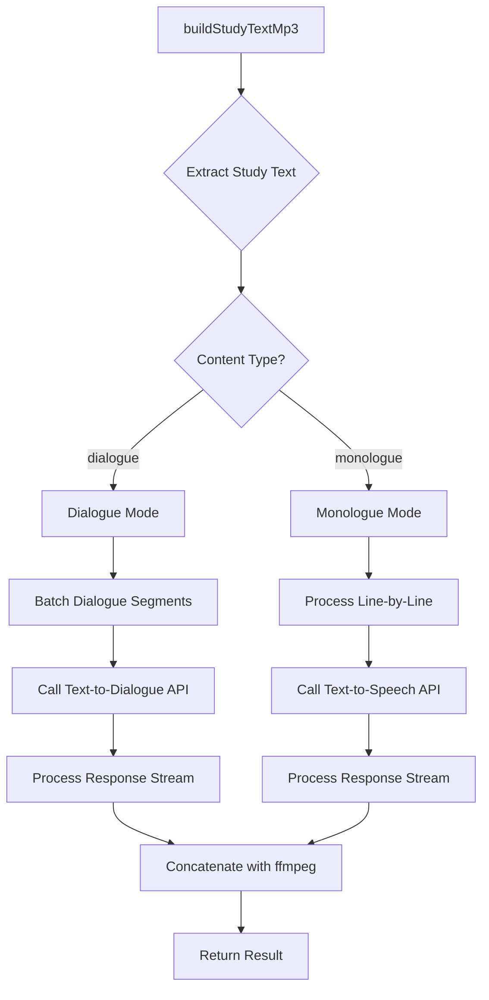
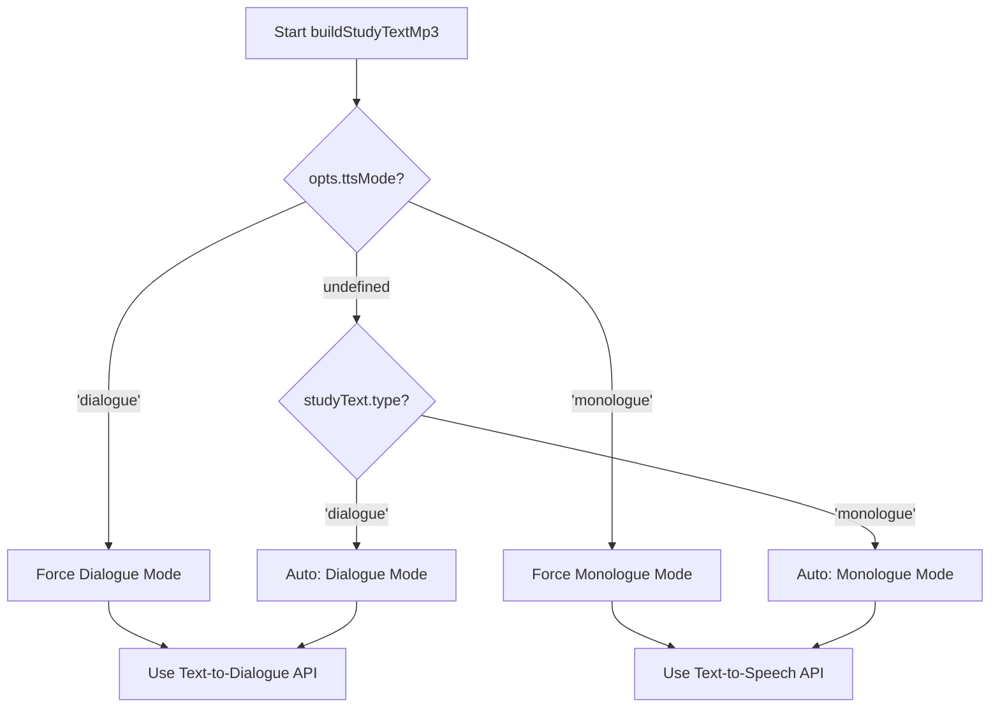

# Dual TTS Mode Architecture Design

## Executive Summary

This document specifies the architecture for adding Text-to-Dialogue API support to `@esl-pipeline/tts-elevenlabs` while maintaining backward compatibility with the existing Text-to-Speech API implementation.

**Key Design Decisions:**

- Automatic mode selection based on content type detection (already available via `extractStudyText`)
- Separate API client methods for dialogue vs. monologue synthesis
- Minimal changes to existing code paths to ensure backward compatibility
- CLI flag override for testing and debugging
- Reuse existing voice mapping and speaker assignment infrastructure

---

## 1. Architecture Overview

### 1.1 High-Level Flow



### 1.2 Integration Points

The dual-mode system integrates at these key points in the existing codebase:

1. **Options Interface** ([`BuildStudyTextOptions`](packages/tts-elevenlabs/src/index.ts:45)) - Add mode override flag
2. **Main Function** ([`buildStudyTextMp3()`](packages/tts-elevenlabs/src/index.ts:70)) - Add mode selection logic
3. **Synthesis Layer** - New dialogue synthesis function alongside existing [`synthesizeLine()`](packages/tts-elevenlabs/src/index.ts:422)
4. **Client Module** ([`eleven.ts`](packages/tts-elevenlabs/src/eleven.ts)) - Add dialogue API method

**Backward Compatibility:** All existing code paths remain unchanged when `type === 'monologue'` or when mode override is not specified.

---

## 2. API Integration Strategy

### 2.1 Client Extension

Extend [`getElevenClient()`](packages/tts-elevenlabs/src/eleven.ts:3) to support both APIs:

**File:** `packages/tts-elevenlabs/src/eleven.ts`

```typescript
import { ElevenLabsClient } from '@elevenlabs/elevenlabs-js';

export function getElevenClient() {
  const apiKey = process.env.ELEVENLABS_API_KEY || process.env.ELEVENLABS_API_TOKEN;
  if (!apiKey) throw new Error('Missing ELEVENLABS_API_KEY');
  return new ElevenLabsClient({ apiKey });
}

/**
 * Call the Text-to-Dialogue API (eleven_v3 model)
 * Returns a binary audio stream (MP3)
 */
export async function synthesizeDialogue(
  inputs: Array<{ text: string; voice_id: string }>,
  options?: {
    languageCode?: string;
    stability?: number;
    seed?: number;
    applyTextNormalization?: 'auto' | 'on' | 'off';
    outputFormat?: string;
  },
): Promise<ReadableStream> {
  const apiKey = process.env.ELEVENLABS_API_KEY || process.env.ELEVENLABS_API_TOKEN;
  if (!apiKey) throw new Error('Missing ELEVENLABS_API_KEY');

  const outputFormat =
    options?.outputFormat ?? process.env.ELEVENLABS_OUTPUT_FORMAT ?? 'mp3_22050_32';

  const response = await fetch('https://api.elevenlabs.io/v1/text-to-dialogue', {
    method: 'POST',
    headers: {
      'xi-api-key': apiKey,
      'Content-Type': 'application/json',
    },
    body: JSON.stringify({
      inputs,
      model_id: 'eleven_v3',
      language_code: options?.languageCode,
      settings: options?.stability !== undefined ? { stability: options.stability } : undefined,
      seed: options?.seed,
      apply_text_normalization: options?.applyTextNormalization ?? 'auto',
    }),
  });

  if (!response.ok) {
    const errorText = await response.text().catch(() => 'Unknown error');
    throw new Error(`Text-to-Dialogue API failed (${response.status}): ${errorText}`);
  }

  if (!response.body) {
    throw new Error('Text-to-Dialogue API returned no body');
  }

  return response.body;
}
```

### 2.2 API Comparison

| Feature        | Text-to-Speech (Current)                       | Text-to-Dialogue (New)           |
| -------------- | ---------------------------------------------- | -------------------------------- |
| Model ID       | `eleven_multilingual_v2`                       | `eleven_v3`                      |
| Endpoint       | `/v1/text-to-speech/{voice_id}`                | `/v1/text-to-dialogue`           |
| Input          | Single text + voice_id                         | Array of {text, voice_id}        |
| Use Case       | Monologue, single speaker                      | Multi-speaker dialogue           |
| Voice Settings | stability, similarity_boost, use_speaker_boost | stability only                   |
| Language Code  | Not supported                                  | Optional language_code parameter |

---

## 3. Mode Selection Logic

### 3.1 Decision Flow



### 3.2 Implementation

**File:** `packages/tts-elevenlabs/src/index.ts`

```typescript
type BuildStudyTextOptions = {
  voiceMapPath: string;
  outPath: string;
  preview?: boolean;
  force?: boolean;
  defaultAccent?: string;
  ffmpegPath?: string;
  ttsMode?: 'auto' | 'dialogue' | 'monologue'; // NEW
};

export async function buildStudyTextMp3(
  mdPath: string,
  opts: BuildStudyTextOptions,
): Promise<BuildStudyTextResult> {
  // ... existing code ...
  const studyText = extractStudyText(mdContent);

  // Determine effective TTS mode
  const effectiveMode = resolveEffectiveTtsMode(studyText.type, opts.ttsMode);

  // ... rest of existing code ...

  // Branch based on mode
  if (effectiveMode === 'dialogue') {
    await synthesizeDialogueSegments(segments, speakerVoiceMap, outputDir, opts);
  } else {
    await synthesizeMonologueSegments(segments, speakerVoiceMap, outputDir, opts);
  }

  // ... concatenation and return ...
}

function resolveEffectiveTtsMode(
  contentType: 'monologue' | 'dialogue',
  override?: 'auto' | 'dialogue' | 'monologue',
): 'dialogue' | 'monologue' {
  if (override === 'dialogue') return 'dialogue';
  if (override === 'monologue') return 'monologue';
  // auto or undefined: use content type
  return contentType;
}
```

### 3.3 Environment Variable Support

```bash
# Optional: Set default mode (overrides auto-detection)
ELEVENLABS_TTS_MODE=dialogue  # or 'monologue' or 'auto' (default)
```

---

## 4. Voice Mapping for Dialogue Mode

### 4.1 Reuse Existing Infrastructure

The dialogue mode **reuses** the existing [`resolveSpeakerVoices()`](packages/tts-elevenlabs/src/speakerAssignment.ts) system without modification. This function already:

- Maps speakers to voice IDs
- Handles speaker profiles from frontmatter
- Supports voice map configuration
- Provides fallback logic

### 4.2 Speaker-to-Voice Resolution

```typescript
// Existing code in buildStudyTextMp3 already does this:
const assignments = await resolveSpeakerVoices({
  speakers,
  profiles: Array.isArray(frontmatter.speaker_profiles) ? frontmatter.speaker_profiles : undefined,
  voiceMap,
  catalog,
  mode: studyText.type, // 'dialogue' or 'monologue'
  defaultAccent: opts.defaultAccent,
});

const speakerVoiceMap = new Map(assignments.map((a) => [a.speaker, a.voiceId]));
```

**No changes needed** - dialogue mode uses the same `speakerVoiceMap` to build API inputs.

### 4.3 Error Handling

```typescript
// In dialogue synthesis function
function buildDialogueInputs(
  segments: StudyTextSegment[],
  speakerVoiceMap: Map<string, string>,
  fallbackVoiceId: string,
): Array<{ text: string; voice_id: string }> {
  const inputs: Array<{ text: string; voice_id: string }> = [];

  for (const segment of segments) {
    const speechText = cleanSpeechText(segment.text);
    if (!speechText) continue;

    const normalizedSpeaker = segment.speaker?.trim() ?? '';
    let voiceId = speakerVoiceMap.get(normalizedSpeaker);

    if (!voiceId && normalizedSpeaker) {
      // Case-insensitive fallback
      for (const [speaker, vid] of speakerVoiceMap.entries()) {
        if (speaker.toLowerCase() === normalizedSpeaker.toLowerCase()) {
          voiceId = vid;
          break;
        }
      }
    }

    if (!voiceId) {
      voiceId = fallbackVoiceId;
    }

    if (!voiceId) {
      throw new Error(
        `No voice ID resolved for speaker "${normalizedSpeaker}" in segment: ${segment.raw}`,
      );
    }

    inputs.push({ text: speechText, voice_id: voiceId });
  }

  return inputs;
}
```

---

## 5. Segment Processing & Batching

### 5.1 Dialogue Mode Strategy

**Decision:** Send entire dialogue in a single API request when possible, with chunking for very long dialogues.

**Rationale:**

- Text-to-Dialogue API is designed for multi-turn conversations
- Single request maintains better speaker continuity and natural flow
- Reduces API calls and latency
- Simplifies caching (one file per dialogue)

### 5.2 Chunking Logic

```typescript
const MAX_DIALOGUE_INPUTS = 100; // Conservative limit
const MAX_TOTAL_CHARS = 5000; // Prevent timeouts

function chunkDialogueInputs(
  inputs: Array<{ text: string; voice_id: string }>,
): Array<Array<{ text: string; voice_id: string }>> {
  const chunks: Array<Array<{ text: string; voice_id: string }>> = [];
  let currentChunk: Array<{ text: string; voice_id: string }> = [];
  let currentChars = 0;

  for (const input of inputs) {
    const inputChars = input.text.length;

    // Start new chunk if limits exceeded
    if (currentChunk.length >= MAX_DIALOGUE_INPUTS || currentChars + inputChars > MAX_TOTAL_CHARS) {
      if (currentChunk.length > 0) {
        chunks.push(currentChunk);
        currentChunk = [];
        currentChars = 0;
      }
    }

    currentChunk.push(input);
    currentChars += inputChars;
  }

  if (currentChunk.length > 0) {
    chunks.push(currentChunk);
  }

  return chunks.length > 0 ? chunks : [inputs];
}
```

### 5.3 Synthesis Functions

**File:** `packages/tts-elevenlabs/src/index.ts`

```typescript
/**
 * Synthesize dialogue segments using Text-to-Dialogue API
 */
async function synthesizeDialogueSegments(
  segments: StudyTextSegment[],
  speakerVoiceMap: Map<string, string>,
  outputDir: string,
  opts: BuildStudyTextOptions,
): Promise<string[]> {
  const segmentFiles: string[] = [];
  const fallbackVoiceId = speakerVoiceMap.values().next().value;

  // Build dialogue inputs
  const inputs = buildDialogueInputs(segments, speakerVoiceMap, fallbackVoiceId);

  // Chunk if necessary
  const chunks = chunkDialogueInputs(inputs);

  // Generate hash for caching
  const dialogueHash = createHash('sha256').update(JSON.stringify(inputs)).digest('hex');

  for (let i = 0; i < chunks.length; i++) {
    const chunk = chunks[i]!;
    const chunkHash = chunks.length > 1 ? `${dialogueHash}-chunk${i}` : dialogueHash;
    const chunkFileName = `${chunkHash}.mp3`;
    const chunkFilePath = resolve(outputDir, chunkFileName);

    // Check cache
    if (!opts.force && (await fileExistsNonEmpty(chunkFilePath))) {
      segmentFiles.push(chunkFilePath);
      continue;
    }

    // Synthesize with retry
    await synthesizeDialogueWithRetry(chunk, chunkFilePath);
    segmentFiles.push(chunkFilePath);
  }

  return segmentFiles;
}

/**
 * Synthesize monologue segments using Text-to-Speech API (existing logic)
 */
async function synthesizeMonologueSegments(
  segments: StudyTextSegment[],
  speakerVoiceMap: Map<string, string>,
  outputDir: string,
  opts: BuildStudyTextOptions,
): Promise<string[]> {
  // This is the EXISTING code from buildStudyTextMp3 (lines 166-214)
  // Extract into separate function for clarity
  const segmentFiles: string[] = [];
  const eleven = getElevenClient();
  const fallbackVoiceId = speakerVoiceMap.values().next().value;

  for (const segment of segments) {
    // ... existing line-by-line synthesis logic ...
  }

  return segmentFiles;
}

async function synthesizeDialogueWithRetry(
  inputs: Array<{ text: string; voice_id: string }>,
  outFile: string,
  maxAttempts = 3,
): Promise<void> {
  let attempt = 0;
  let lastError: unknown;

  while (attempt < maxAttempts) {
    try {
      const stream = await synthesizeDialogue(inputs);
      const nodeStream = Readable.fromWeb(stream as unknown as NodeReadableStream);
      await pipeline(nodeStream, createWriteStream(outFile));
      return;
    } catch (err: any) {
      lastError = err;
      const status = err?.status ?? err?.statusCode ?? err?.response?.status;
      if (!RETRYABLE_STATUS.has(status) || attempt === maxAttempts - 1) {
        throw new Error(
          `Failed to synthesize dialogue: ${err instanceof Error ? err.message : String(err)}`,
        );
      }
      await wait(400 * Math.pow(2, attempt));
      attempt++;
    }
  }

  throw new Error(`Failed to synthesize dialogue after ${maxAttempts} attempts: ${lastError}`);
}
```

---

## 6. Configuration & Environment

### 6.1 New Environment Variables

```bash
# Mode override (optional)
ELEVENLABS_TTS_MODE=auto          # 'auto' (default), 'dialogue', 'monologue'

# Dialogue-specific settings (optional)
ELEVENLABS_DIALOGUE_LANGUAGE=en   # Language code for dialogue API
ELEVENLABS_DIALOGUE_STABILITY=0.5 # Stability setting (0.0-1.0)

# Existing variables (unchanged)
ELEVENLABS_API_KEY=sk_...
ELEVENLABS_MODEL_ID=eleven_multilingual_v2  # Used for monologue mode
ELEVENLABS_OUTPUT_FORMAT=mp3_22050_32
ELEVENLABS_SILENCE_TAIL_SECONDS=0.4
```

### 6.2 Options Interface Extension

```typescript
type BuildStudyTextOptions = {
  voiceMapPath: string;
  outPath: string;
  preview?: boolean;
  force?: boolean;
  defaultAccent?: string;
  ffmpegPath?: string;

  // NEW: TTS mode control
  ttsMode?: 'auto' | 'dialogue' | 'monologue';

  // NEW: Dialogue-specific options
  dialogueLanguage?: string;
  dialogueStability?: number;
};
```

### 6.3 CLI Flag Design

**File:** `packages/tts-elevenlabs/bin/cli.ts`

```typescript
program
  .option('--md <path>', 'Path to markdown file')
  .option('--voice-map <path>', 'Path to voice map YAML')
  .option('--out <path>', 'Output directory')
  .option('--preview', 'Preview mode (no actual synthesis)')
  .option('--force', 'Force regeneration (ignore cache)')
  .option('--default-accent <accent>', 'Default accent for auto voice selection')
  .option('--ffmpeg-path <path>', 'Path to ffmpeg binary')
  .option('--tts-mode <mode>', 'TTS mode: auto (default), dialogue, monologue', 'auto')
  .option('--dialogue-language <code>', 'Language code for dialogue API (e.g., en, es)')
  .option('--dialogue-stability <value>', 'Stability for dialogue API (0.0-1.0)', parseFloat);
```

---

## 7. Error Handling & Retries

### 7.1 Retry Strategy

Reuse existing retry logic with dialogue-specific error messages:

```typescript
const RETRYABLE_STATUS = new Set([408, 409, 425, 429, 500, 502, 503, 504]);

async function synthesizeDialogueWithRetry(
  inputs: Array<{ text: string; voice_id: string }>,
  outFile: string,
  maxAttempts = 3,
): Promise<void> {
  let attempt = 0;
  let lastError: unknown;

  while (attempt < maxAttempts) {
    try {
      await synthesizeDialogueChunk(inputs, outFile);
      return;
    } catch (err: any) {
      lastError = err;
      const status = err?.status ?? err?.statusCode ?? err?.response?.status;

      // Don't retry on client errors (except rate limit)
      if (!RETRYABLE_STATUS.has(status) || attempt === maxAttempts - 1) {
        throw wrapDialogueError(err, inputs);
      }

      // Exponential backoff
      const delayMs = 400 * Math.pow(2, attempt);
      await wait(delayMs);
      attempt++;
    }
  }

  throw wrapDialogueError(lastError, inputs);
}

function wrapDialogueError(
  error: unknown,
  inputs: Array<{ text: string; voice_id: string }>,
): Error {
  const message = error instanceof Error ? error.message : String(error);
  const speakerCount = new Set(inputs.map((i) => i.voice_id)).size;
  const lineCount = inputs.length;

  return new Error(
    `Failed to synthesize dialogue (${lineCount} lines, ${speakerCount} speakers): ${message}`,
  );
}
```

### 7.2 Rate Limiting

```typescript
// Handle 429 (rate limit) with longer backoff
if (status === 429) {
  const retryAfter = err?.response?.headers?.['retry-after'];
  const delayMs = retryAfter ? parseInt(retryAfter, 10) * 1000 : 2000 * Math.pow(2, attempt);
  await wait(delayMs);
}
```

### 7.3 Timeout Configuration

```typescript
const DIALOGUE_TIMEOUT_MS = 60000; // 60 seconds for dialogue API

async function synthesizeDialogueChunk(
  inputs: Array<{ text: string; voice_id: string }>,
  outFile: string,
): Promise<void> {
  const controller = new AbortController();
  const timeoutId = setTimeout(() => controller.abort(), DIALOGUE_TIMEOUT_MS);

  try {
    const stream = await synthesizeDialogue(inputs, {
      signal: controller.signal,
    });
    const nodeStream = Readable.fromWeb(stream as unknown as NodeReadableStream);
    await pipeline(nodeStream, createWriteStream(outFile));
  } finally {
    clearTimeout(timeoutId);
  }
}
```

### 7.4 Fallback Behavior

```typescript
// If dialogue API fails repeatedly, optionally fall back to monologue mode
async function synthesizeWithFallback(
  segments: StudyTextSegment[],
  speakerVoiceMap: Map<string, string>,
  outputDir: string,
  opts: BuildStudyTextOptions,
  preferredMode: 'dialogue' | 'monologue',
): Promise<string[]> {
  try {
    if (preferredMode === 'dialogue') {
      return await synthesizeDialogueSegments(segments, speakerVoiceMap, outputDir, opts);
    } else {
      return await synthesizeMonologueSegments(segments, speakerVoiceMap, outputDir, opts);
    }
  } catch (err) {
    // Only fallback if explicitly enabled
    if (process.env.ELEVENLABS_FALLBACK_MODE === 'true' && preferredMode === 'dialogue') {
      console.warn('Dialogue API failed, falling back to monologue mode:', err);
      return await synthesizeMonologueSegments(segments, speakerVoiceMap, outputDir, opts);
    }
    throw err;
  }
}
```

---

## 8. Backward Compatibility

### 8.1 Compatibility Guarantees

1. **Default Behavior:** Without any new flags/env vars, behavior is identical to current implementation
2. **Existing Callers:** All existing code continues to work without modification
3. **API Signature:** `BuildStudyTextOptions` extended with optional fields only
4. **File Naming:** Hash-based naming unchanged; dialogue mode uses same pattern
5. **Caching:** Existing cache files remain valid

### 8.2 Migration Path

**Phase 1: Opt-in (Initial Release)**

```typescript
// Users must explicitly enable dialogue mode
const result = await buildStudyTextMp3(mdPath, {
  ...opts,
  ttsMode: 'dialogue', // Explicit opt-in
});
```

**Phase 2: Auto-detection (Future Release)**

```typescript
// After validation period, enable auto-detection by default
// Users can still override if needed
const result = await buildStudyTextMp3(mdPath, {
  ...opts,
  ttsMode: 'auto', // Default behavior
});
```

### 8.3 Deprecation Strategy

No deprecations needed - this is purely additive functionality.

---

## 9. Testing Strategy

### 9.1 Unit Tests

**File:** `packages/tts-elevenlabs/tests/dual-mode.test.ts`

```typescript
import { describe, expect, it, vi } from 'vitest';

import * as eleven from '../src/eleven.js';
import { buildStudyTextMp3 } from '../src/index.js';

describe('Dual TTS Mode', () => {
  describe('Mode Selection', () => {
    it('should use dialogue mode for dialogue content with auto mode', async () => {
      const spy = vi.spyOn(eleven, 'synthesizeDialogue');
      // Test with dialogue content
      await buildStudyTextMp3('fixtures/dialogue.md', {
        voiceMapPath: 'configs/voices.yml',
        outPath: './out',
        ttsMode: 'auto',
      });
      expect(spy).toHaveBeenCalled();
    });

    it('should use monologue mode for monologue content with auto mode', async () => {
      const spy = vi.spyOn(eleven, 'getElevenClient');
      // Test with monologue content
      await buildStudyTextMp3('fixtures/monologue.md', {
        voiceMapPath: 'configs/voices.yml',
        outPath: './out',
        ttsMode: 'auto',
      });
      expect(spy).toHaveBeenCalled();
    });

    it('should force dialogue mode when explicitly set', async () => {
      const spy = vi.spyOn(eleven, 'synthesizeDialogue');
      // Even with monologue content
      await buildStudyTextMp3('fixtures/monologue.md', {
        voiceMapPath: 'configs/voices.yml',
        outPath: './out',
        ttsMode: 'dialogue',
      });
      expect(spy).toHaveBeenCalled();
    });
  });

  describe('Voice Mapping', () => {
    it('should map multiple speakers to voice IDs in dialogue mode', async () => {
      // Test speaker-to-voice resolution
    });

    it('should handle missing speaker mappings gracefully', async () => {
      // Test fallback logic
    });
  });

  describe('Chunking', () => {
    it('should chunk large dialogues', () => {
      const inputs = Array(150).fill({ text: 'test', voice_id: 'voice1' });
      const chunks = chunkDialogueInputs(inputs);
      expect(chunks.length).toBeGreaterThan(1);
    });

    it('should not chunk small dialogues', () => {
      const inputs = Array(10).fill({ text: 'test', voice_id: 'voice1' });
      const chunks = chunkDialogueInputs(inputs);
      expect(chunks.length).toBe(1);
    });
  });

  describe('Error Handling', () => {
    it('should retry on 429 rate limit', async () => {
      // Mock 429 response
    });

    it('should not retry on 400 bad request', async () => {
      // Mock 400 response
    });

    it('should timeout after configured duration', async () => {
      // Mock slow response
    });
  });
});
```

### 9.2 Integration Tests

```typescript
describe('Integration: Dual Mode Pipeline', () => {
  it('should generate dialogue audio end-to-end', async () => {
    // Real API call (requires ELEVENLABS_API_KEY)
    const result = await buildStudyTextMp3('fixtures/dialogue.md', {
      voiceMapPath: 'configs/voices.yml',
      outPath: './test-output',
      ttsMode: 'dialogue',
    });

    expect(result.path).toMatch(/\.mp3$/);
    expect(result.voices.length).toBeGreaterThan(1);
  });

  it('should maintain backward compatibility with monologue mode', async () => {
    // Ensure existing behavior unchanged
  });
});
```

### 9.3 Mock Strategy

```typescript
// Mock the fetch call for dialogue API
vi.mock('node:fetch', () => ({
  default: vi.fn((url, options) => {
    if (url.includes('text-to-dialogue')) {
      return Promise.resolve({
        ok: true,
        body: createMockAudioStream(),
      });
    }
    // ... other mocks
  }),
}));

function createMockAudioStream(): ReadableStream {
  return new ReadableStream({
    start(controller) {
      // Mock MP3 data
      controller.enqueue(new Uint8Array([0xff, 0xfb, 0x90, 0x00]));
      controller.close();
    },
  });
}
```

---

## 10. File Structure Changes

### 10.1 New Files

```
packages/tts-elevenlabs/
├── src/
│   ├── dialogue.ts          # NEW: Dialogue-specific synthesis logic
│   └── monologue.ts         # NEW: Extracted monologue logic (refactor)
├── tests/
│   ├── dialogue.test.ts     # NEW: Dialogue mode tests
│   └── dual-mode.test.ts    # NEW: Mode selection tests
└── DESIGN-dual-mode.md      # THIS FILE
```

### 10.2 Modified Files

```
packages/tts-elevenlabs/
├── src/
│   ├── index.ts             # MODIFIED: Add mode selection, refactor synthesis
│   ├── eleven.ts            # MODIFIED: Add synthesizeDialogue function
│   └── types.ts             # NEW: Shared types for dialogue/monologue
├── bin/
│   └── cli.ts               # MODIFIED: Add --tts-mode flag
└── README.md                # MODIFIED: Document dual-mode feature
```

### 10.3 Detailed File Changes

#### `src/index.ts` Changes

```typescript
// ADD: Import dialogue synthesis
import { synthesizeDialogueSegments } from './dialogue.js';
import { synthesizeMonologueSegments } from './monologue.js';

// MODIFY: BuildStudyTextOptions interface (add ttsMode, dialogueLanguage, dialogueStability)

// MODIFY: buildStudyTextMp3 function
export async function buildStudyTextMp3(
  mdPath: string,
  opts: BuildStudyTextOptions,
): Promise<BuildStudyTextResult> {
  // ... existing code up to line 102 ...

  // ADD: Determine effective mode
  const effectiveMode = resolveEffectiveTtsMode(studyText.type, opts.ttsMode);

  // ... existing code for hash, output path, cache check ...

  // REPLACE: Lines 166-214 with mode-based dispatch
  let segmentFiles: string[];
  if (effectiveMode === 'dialogue') {
    segmentFiles = await synthesizeDialogueSegments(
      segments,
      speakerVoiceMap,
      outputDir,
      opts,
      fallbackVoiceId,
    );
  } else {
    segmentFiles = await synthesizeMonologueSegments(
      segments,
      speakerVoiceMap,
      outputDir,
      opts,
      fallbackVoiceId,
    );
  }

  // ... rest unchanged (concatenation, metadata, return) ...
}

// ADD: Helper function
function resolveEffectiveTtsMode(
  contentType: 'monologue' | 'dialogue',
  override?: 'auto' | 'dialogue' | 'monologue',
): 'dialogue' | 'monologue' {
  const envMode = process.env.ELEVENLABS_TTS_MODE?.toLowerCase();
  const effectiveOverride = override ?? envMode;

  if (effectiveOverride === 'dialogue') return 'dialogue';
  if (effectiveOverride === 'monologue') return 'monologue';
  return contentType; // auto or undefined
}
```

#### `src/eleven.ts` Changes

```typescript
// ADD: synthesizeDialogue function (see section 2.1)
export async function synthesizeDialogue(
  inputs: Array<{ text: string; voice_id: string }>,
  options?: { ... }
): Promise<ReadableStream> {
  // Implementation from section 2.1
}
```

#### `src/dialogue.ts` (New File)

```typescript
import { createHash } from 'node:crypto';
import { createWriteStream } from 'node:fs';
import { resolve } from 'node:path';
import { Readable } from 'node:stream';
import { pipeline } from 'node:stream/promises';
import type { ReadableStream as NodeReadableStream } from 'node:stream/web';

import { synthesizeDialogue } from './eleven.js';
import { cleanSpeechText, fileExistsNonEmpty, wait } from './index.js';
import type { BuildStudyTextOptions, StudyTextSegment } from './types.js';

const RETRYABLE_STATUS = new Set([408, 409, 425, 429, 500, 502, 503, 504]);
const MAX_DIALOGUE_INPUTS = 100;
const MAX_TOTAL_CHARS = 5000;

export async function synthesizeDialogueSegments(
  segments: StudyTextSegment[],
  speakerVoiceMap: Map<string, string>,
  outputDir: string,
  opts: BuildStudyTextOptions,
  fallbackVoiceId?: string,
): Promise<string[]> {
  // Implementation from section 5.3
}

function buildDialogueInputs(
  segments: StudyTextSegment[],
  speakerVoiceMap: Map<string, string>,
  fallbackVoiceId?: string,
): Array<{ text: string; voice_id: string }> {
  // Implementation from section 4.3
}

function chunkDialogueInputs(
  inputs: Array<{ text: string; voice_id: string }>,
): Array<Array<{ text: string; voice_id: string }>> {
  // Implementation from section 5.2
}

async function synthesizeDialogueWithRetry(
  inputs: Array<{ text: string; voice_id: string }>,
  outFile: string,
  maxAttempts = 3,
): Promise<void> {
  // Implementation from section 7.1
}
```

#### `src/monologue.ts` (New File)

```typescript
// Extract existing line-by-line synthesis logic from index.ts (lines 166-214)
import { createHash } from 'node:crypto';
import { resolve } from 'node:path';

import { getElevenClient } from './eleven.js';
import { cleanSpeechText, fileExistsNonEmpty, synthesizeLineWithRetry } from './index.js';
import type { BuildStudyTextOptions, StudyTextSegment } from './types.js';

export async function synthesizeMonologueSegments(
  segments: StudyTextSegment[],
  speakerVoiceMap: Map<string, string>,
  outputDir: string,
  opts: BuildStudyTextOptions,
  fallbackVoiceId?: string,
): Promise<string[]> {
  const segmentFiles: string[] = [];
  const eleven = getElevenClient();

  for (const segment of segments) {
    // ... existing logic from buildStudyTextMp3 lines 172-213 ...
  }

  return segmentFiles;
}
```

#### `src/types.ts` (New File)

```typescript
export type StudyTextSegment = {
  speaker?: string;
  text: string;
  raw: string;
};

export type BuildStudyTextOptions = {
  voiceMapPath: string;
  outPath: string;
  preview?: boolean;
  force?: boolean;
  defaultAccent?: string;
  ffmpegPath?: string;
  ttsMode?: 'auto' | 'dialogue' | 'monologue';
  dialogueLanguage?: string;
  dialogueStability?: number;
};
```

---

## 11. Implementation Checklist

### Phase 1: Core Infrastructure

- [ ] Add `synthesizeDialogue()` to `src/eleven.ts`
- [ ] Create `src/types.ts` with shared types
- [ ] Add `resolveEffectiveTtsMode()` helper
- [ ] Extend `BuildStudyTextOptions` interface

### Phase 2: Dialogue Mode

- [ ] Create `src/dialogue.ts` with dialogue synthesis logic
- [ ] Implement `buildDialogueInputs()`
- [ ] Implement `chunkDialogueInputs()`
- [ ] Implement `synthesizeDialogueWithRetry()`

### Phase 3: Refactoring

- [ ] Create `src/monologue.ts` and extract existing logic
- [ ] Update `buildStudyTextMp3()` to dispatch based on mode
- [ ] Add mode selection logic

### Phase 4: CLI & Configuration

- [ ] Add `--tts-mode` flag to CLI
- [ ] Add `--dialogue-language` and `--dialogue-stability` flags
- [ ] Add environment variable support

### Phase 5: Testing

- [ ] Write unit tests for mode selection
- [ ] Write unit tests for dialogue synthesis
- [ ] Write unit tests for chunking logic
- [ ] Write integration tests
- [ ] Add mock strategy for API calls

### Phase 6: Documentation

- [ ] Update README.md with dual-mode documentation
- [ ] Add examples for dialogue mode usage
- [ ] Document environment variables
- [ ] Add troubleshooting guide

---

## 12. Dependencies

### 12.1 No New Dependencies Required

All functionality can be implemented using existing dependencies:

- `@elevenlabs/elevenlabs-js` - Already installed (v2.22.0)
- `node:fetch` - Built-in (Node 24.10.0+)
- `node:stream` - Built-in
- All other dependencies unchanged

### 12.2 Minimum Version Requirements

- Node.js: 24.10.0+ (already required)
- `@elevenlabs/elevenlabs-js`: 2.22.0+ (current version)

---

## 13. Performance Considerations

### 13.1 Dialogue Mode Advantages

- **Fewer API Calls:** Single request vs. N requests (where N = number of lines)
- **Better Caching:** One cache file per dialogue vs. many small files
- **Reduced Latency:** Parallel processing within ElevenLabs infrastructure
- **Natural Flow:** Better speaker transitions and prosody

### 13.2 Potential Bottlenecks

- **Large Dialogues:** May timeout if too many lines (mitigated by chunking)
- **Memory Usage:** Entire dialogue held in memory (acceptable for typical use cases)
- **Network:** Single large response vs. many small ones (generally faster)

### 13.3 Optimization Strategies

```typescript
// Cache dialogue chunks independently
const chunkHash = createHash('sha256').update(JSON.stringify(chunk)).digest('hex');

// Parallel chunk processing (if multiple chunks)
const chunkPromises = chunks.map((chunk, i) =>
  synthesizeDialogueChunk(chunk, `${hash}-chunk${i}.mp3`),
);
await Promise.all(chunkPromises);
```

---

## 14. Security Considerations

### 14.1 API Key Handling

- Reuse existing secure key handling from `getElevenClient()`
- No changes to key storage or transmission

### 14.2 Input Validation

```typescript
function validateDialogueInputs(inputs: Array<{ text: string; voice_id: string }>): void {
  if (inputs.length === 0) {
    throw new Error('Dialogue inputs cannot be empty');
  }

  for (const input of inputs) {
    if (!input.text || typeof input.text !== 'string') {
      throw new Error('Invalid dialogue input: text must be a non-empty string');
    }
    if (!input.voice_id || typeof input.voice_id !== 'string') {
      throw new Error('Invalid dialogue input: voice_id must be a non-empty string');
    }
    // Prevent injection attacks
    if (input.text.length > 10000) {
      throw new Error('Dialogue input text too long (max 10000 characters)');
    }
  }
}
```

### 14.3 Rate Limiting

- Respect ElevenLabs rate limits (handled by retry logic)
- Add exponential backoff for 429 responses
- Consider implementing client-side rate limiting if needed

---

## 15. Monitoring & Observability

### 15.1 Logging

```typescript
// Add mode-specific logging
console.log(`[TTS] Using ${effectiveMode} mode for ${segments.length} segments`);
console.log(`[TTS] Dialogue API: ${chunks.length} chunks, ${inputs.length} total inputs`);

// Log performance metrics
const startTime = Date.now();
await synthesizeDialogueChunk(chunk, outFile);
const duration = Date.now() - startTime;
console.log(`[TTS] Dialogue chunk synthesized in ${duration}ms`);
```

### 15.2 Metrics

Track these metrics for monitoring:

- Mode selection distribution (dialogue vs. monologue)
- API call success/failure rates by mode
- Average synthesis time by mode
- Cache hit rates by mode
- Chunk count distribution

### 15.3 Error Reporting

```typescript
// Structured error reporting
function reportSynthesisError(
  mode: 'dialogue' | 'monologue',
  error: Error,
  context: {
    segmentCount: number;
    speakerCount: number;
    totalChars: number;
  },
): void {
  console.error('[TTS] Synthesis failed', {
    mode,
    error: error.message,
    stack: error.stack,
    ...context,
  });
}
```

---

## 16. Future Enhancements

### 16.1 Short-term (Next Release)

- [ ] Add support for language code auto-detection from frontmatter
- [ ] Implement client-side rate limiting
- [ ] Add progress callbacks for long dialogues
- [ ] Support custom voice settings per speaker

### 16.2 Medium-term

- [ ] Streaming synthesis for very long dialogues
- [ ] Parallel chunk processing
- [ ] Advanced caching strategies (CDN integration)
- [ ] Voice cloning support

### 16.3 Long-term

- [ ] Real-time dialogue generation
- [ ] Interactive voice selection UI
- [ ] Multi-language dialogue support
- [ ] Custom model fine-tuning integration

---

## 17. Migration Guide

### 17.1 For Existing Users

**No action required** - existing code continues to work unchanged.

### 17.2 To Enable Dialogue Mode

**Option 1: Environment Variable**

```bash
export ELEVENLABS_TTS_MODE=auto
```

**Option 2: CLI Flag**

```bash
pnpm cli:tts --md lesson.md --voice-map voices.yml --tts-mode dialogue
```

**Option 3: Programmatic**

```typescript
const result = await buildStudyTextMp3(mdPath, {
  voiceMapPath: 'voices.yml',
  outPath: './out',
  ttsMode: 'auto', // or 'dialogue'
});
```

### 17.3 Troubleshooting

**Issue:** Dialogue mode not working

- Check `ELEVENLABS_API_KEY` is set
- Verify content type is detected as 'dialogue' (at least 2 speaker lines)
- Check logs for mode selection output

**Issue:** Voice mapping errors

- Ensure `voices.yml` has entries for all speakers
- Check speaker names match between markdown and voice map
- Verify fallback voice is configured

---

## 18. Conclusion

This design provides a robust, backward-compatible implementation of dual TTS mode support that:

1. **Leverages existing infrastructure** - Reuses voice mapping, speaker assignment, and caching systems
2. **Maintains backward compatibility** - No breaking changes to existing code
3. **Provides flexibility** - Auto-detection with manual override capability
4. **Handles edge cases** - Chunking, retries, fallbacks, and error handling
5. **Enables future growth** - Clean architecture for additional modes or features

The implementation can be completed in phases, with each phase independently testable and deployable.

**Key Success Metrics:**

- Zero breaking changes to existing functionality
- Successful synthesis of multi-speaker dialogues
- Improved performance for dialogue content (fewer API calls)
- Comprehensive test coverage (>90%)
- Clear documentation and migration path

---

## Appendix A: API Request Examples

### A.1 Text-to-Dialogue Request

```bash
curl -X POST https://api.elevenlabs.io/v1/text-to-dialogue \
  -H "xi-api-key: $ELEVENLABS_API_KEY" \
  -H "Content-Type: application/json" \
  -d '{
    "inputs": [
      {
        "text": "Hello, how are you today?",
        "voice_id": "21m00Tcm4TlvDq8ikWAM"
      },
      {
        "text": "I am doing great, thank you for asking!",
        "voice_id": "AZnzlk1XvdvUeBnXmlld"
      }
    ],
    "model_id": "eleven_v3",
    "language_code": "en",
    "settings": {
      "stability": 0.5
    }
  }' \
  --output dialogue.mp3
```

### A.2 Text-to-Speech Request (Current)

```bash
curl -X POST https://api.elevenlabs.io/v1/text-to-speech/21m00Tcm4TlvDq8ikWAM \
  -H "xi-api-key: $ELEVENLABS_API_KEY" \
  -H "Content-Type: application/json" \
  -d '{
    "text": "Hello, how are you today?",
    "model_id": "eleven_multilingual_v2",
    "voice_settings": {
      "stability": 0.5,
      "similarity_boost": 0.75
    }
  }' \
  --output monologue.mp3
```

---

## Appendix B: Example Markdown Files

### B.1 Dialogue Content

```markdown
---
title: Restaurant Conversation
student: Anna
level: B1
speaker_labels: [Customer, Waiter]
speaker_profiles:
  - id: Customer
    gender: female
    role: student
  - id: Waiter
    gender: male
    role: narrator
---

:::study-text

Customer: Good evening, I'd like a table for two, please.
Waiter: Of course! Right this way. Here's your menu.
Customer: Thank you. What do you recommend?
Waiter: Our pasta special is excellent today.

:::
```

### B.2 Monologue Content

```markdown
---
title: Weather Report
student: Anna
level: A2
speaker_labels: [Narrator]
---

:::study-text

Today's weather will be mostly sunny with a high of 75 degrees.
There's a slight chance of rain in the evening.
Don't forget your umbrella just in case!

:::
```

---

**Document Version:** 1.0  
**Last Updated:** 2025-11-12  
**Author:** Kilo Code (Architect Mode)  
**Status:** Ready for Implementation
